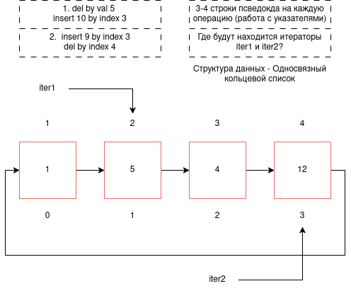

Анализ исходного состояния списка

Из изображения:

    Элементы: 1 → 5 → 4 → 12 → (обратно к 1)

    iter1: указывает на элемент 5 (значение 5, индекс 1)

    iter2: указывает на элемент 12 (значение 12, индекс 3)

    Индексы:

        1: индекс 0

        5: индекс 1 (iter1)

        4: индекс 2

        12: индекс 3 (iter2)

Задание 1: del by val 5, затем insert 10 by index 3
Операция 1: Удаление элемента со значением 5

Позиции итераторов после удаления 5:

    iter1: указывал на удаляемый элемент 5 → перемещается на следующий элемент 4 (индекс 1)

    iter2: указывал на 12 (не удалялся) → остается на 12 (индекс 2)

Состояние списка после удаления 5:
1(0) → 4(1) → 12(2) → (обратно к 1)
iter1 на 4 (индекс 1), iter2 на 12 (индекс 2)
Операция 2: Вставка 10 по индексу 3

Текущий размер списка = 3 (элементы: 1, 4, 12). Индекс 3 означает вставку после последнего элемента (в конец).


Позиции итераторов после вставки 10:

    iter1: на 4 (индекс 1) → остается на 4

    iter2: на 12 (индекс 2) → остается на 12

Итоговое состояние после задания 1:

1(0) → 4(1) → 12(2) → 10(3) → (обратно к 1)
iter1 на 4 (индекс 1), iter2 на 12 (индекс 2)

Задание 2: insert 9 by index 3, затем del by index 4

Исходное состояние (после задания 1)

Список: 1(0) → 4(1) → 12(2) → 10(3) → (обратно к 1)
iter1: на 4 (индекс 1), iter2: на 12 (индекс 2)
Операция 1: Вставка 9 по индексу 3

Индекс 3 означает вставку перед элементом с текущим индексом 3 (перед 10).

Изменение индексов после вставки:

    До: 1(0), 4(1), 12(2), 10(3)

    После: 1(0), 4(1), 12(2), 9(3), 10(4)

Позиции итераторов после вставки 9:

    iter1: на 4 (индекс 1) → остается на 4

    iter2: на 12 (индекс 2) → остается на 12


Состояние списка:

1(0) → 4(1) → 12(2) → 9(3) → 10(4) → (обратно к 1)
iter1 на 4 (индекс 1), iter2 на 12 (индекс 2)
Операция 2: Удаление по индексу 4

Индекс 4 соответствует элементу 10 (последний элемент).

Позиции итераторов после удаления 10:

    iter1: на 4 (индекс 1) → остается на 4

    iter2: на 12 (индекс 2) → остается на 12

Итоговое состояние:
1(0) → 4(1) → 12(2) → 9(3) → (обратно к 1)
iter1 на 4 (индекс 1), iter2 на 12 (индекс 2)

Финальный ответ

Задание 1 (del 5, insert 10 at 3):

    iter1: индекс 1 (элемент 4) - переместился с удаленного элемента 5 на следующий 4

    iter2: индекс 2 (элемент 12) - не изменился

    Аргументация: iter1 указывал на удаляемый элемент 5, поэтому при удалении он автоматически переместился на следующий элемент (4). iter2 не был затронут.

Задание 2 (insert 9 at 3, del at 4):

    iter1: индекс 1 (элемент 4) - не изменился

    iter2: индекс 2 (элемент 12) - не изменился

    Аргументация: Вставка добавила новый элемент, не затронув существующие узлы с итераторами. Удаление затронуло элемент 10, на который итераторы не указывали. Индексы элементов после вставки изменились, но сами итераторы продолжают указывать на те же узлы (4 и 12).

## Псевдокод

Задание 1: 

1) del by val 5

```
// Поиск узла со значением 5 и его предшественника
current = head
prev = null
while current.data != 5:
    prev = current
    current = current.next

// Сохранение следующего узла
nextNode = current.next

// Перестройка указателей (исключение узла из списка)
if prev == null:                 // если удаляется голова
    head = nextNode
    last = найти последний элемент
    last.next = head
else:                            // удаление не головы
    prev.next = nextNode

// Оповещение итераторов
if iter1 указывает на current:
    iter1.current = nextNode
if iter2 указывает на current:
    iter2.current = nextNode

// Удаление узла
delete current
size = size - 1
```

2) insert 10 by index 3

```
// Поиск позиции для вставки (индекс 2 - элемент перед позицией 3)
current = head
for i = 0 to 1:          // проходим до элемента с индексом 2
    current = current.next

// Создание нового узла
newNode = new Node(10)

// Вставка после current
newNode.next = current.next
current.next = newNode

// Обновление размера
size = size + 1

// Итераторы не изменяются (они указывают на другие узлы)
```

Задание 2:

1)insert 9 by index 3

```
// Поиск позиции для вставки (индекс 2 - элемент перед позицией 3)
current = head
for i = 0 to 1:          // проходим до элемента с индексом 2 (12)
    current = current.next

// Создание нового узла
newNode = new Node(9)

// Вставка между 12 и 10
newNode.next = current.next    // newNode.next = 10
current.next = newNode         // 12.next = 9

// Обновление размера
size = size + 1

// Итераторы не изменяются
```

2)del by index 4

```
// Поиск узла для удаления (индекс 4) и его предшественника
prev = head
for i = 0 to 2:          // проходим до элемента с индексом 3 (9)
    prev = prev.next
current = prev.next      // current = 10 (индекс 4)

// Сохранение следующего узла
nextNode = current.next  // nextNode = head (1)

// Перестройка указателей (удаление последнего элемента)
prev.next = nextNode     // 9.next = 1

// Оповещение итераторов
if iter1 указывает на current:    // iter1 на 4 - false
    iter1.current = nextNode
if iter2 указывает на current:    // iter2 на 12 - false
    iter2.current = nextNode

// Удаление узла
delete current
size = size - 1
```


