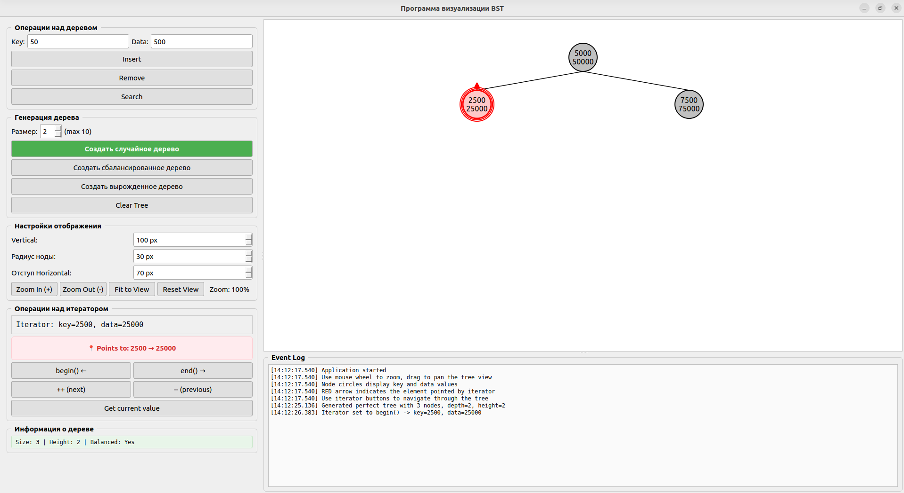

# BST Visualizer - Binary Search Tree Visualization Tool

## 📋 О проекте

**BST Visualizer** - это интерактивное приложение для визуализации и изучения бинарных деревьев поиска (Binary Search Tree). Проект разработан в рамках лабораторной работы №3 по курсу "Алгоритмы и структуры данных" (Вариант 6).

### Особенности реализации (Вариант 6)

- ✅ **Итерационные алгоритмы** операций поиска, вставки и удаления
- ✅ **Симметричный обход** дерева по схеме `Lt → t → Rt` (inorder traversal)
- ✅ **Горизонтальная визуализация** дерева с возможностью масштабирования и панорамирования
- ✅ **Интерактивный итератор** с визуальной стрелкой, указывающей на текущий элемент
- ✅ **Поддержка удаления элемента** с автоматическим перемещением итератора на следующий элемент
- ✅ **Три типа генерации** деревьев: случайное, идеально сбалансированное, вырожденное

## 🚀 Возможности

### Основные операции
- **Вставка** элемента по ключу и данным
- **Удаление** элемента по ключу или через итератор
- **Поиск** элемента по ключу
- **Очистка** всего дерева

### Визуализация
- **Интерактивное отображение** дерева с ключами и данными в узлах
- **Подсветка текущего элемента** итератора красной стрелкой

### Итератор
- **begin()** - установка на минимальный элемент
- **end()** - установка на конец (не указывает на элемент)
- **++ (increment)** - переход к следующему элементу (inorder successor)
- **Автоматическое перемещение** при удалении текущего элемента

### Генерация деревьев
- **Random Tree** - случайное дерево с заданной глубиной
- **Perfect Balanced Tree** - идеально сбалансированное дерево
- **Degenerate Tree** - вырожденное дерево (правый наклон)

### Настройки визуализации
- **Vertical spacing** - вертикальное расстояние между уровнями (50-200 px)
- **Node radius** - радиус узлов (20-50 px)
- **Horizontal offset** - минимальное горизонтальное смещение (40-150 px)

### Дополнительные инструменты
- **Лог-окно** с временными метками всех операций
- **Информация о дереве** (размер, высота, сбалансированность)
- **Бенчмарк** для измерения трудоёмкости операций

## 🛠️ Технологии

| Компонент | Технология |
|-----------|------------|
| Язык программирования | C++17 |
| GUI Framework | Qt5 (Widgets) |
| Тестирование | Google Test (gtest) |
| Система сборки | CMake 3.14+ |
| Компилятор | GCC 7+ / Clang 5+ |

## 📁 Структура проекта

```
BST_Project/
├── CMakeLists.txt          # Конфигурация сборки
├── README.md               # Документация
├── include/
│   ├── bst.hpp            # Заголовочный файл класса BST
│   └── utils.hpp          # Вспомогательные утилиты
├── src/
│   ├── bst.cpp            # Реализация BST
│   └── utils.cpp          # Реализация утилит
├── gui/
│   └── main_gui.cpp       # Графический интерфейс (Qt5)
├── tests/
│   └── test_bst.cpp       # Модульные тесты (Google Test)
├── benchmark/
│   └── benchmark.cpp      # Программа для измерения трудоёмкости
└── build/                 # Директория сборки (создаётся автоматически)
```

## 🔧 Установка и сборка

### Требования

```bash
# Ubuntu/Debian
sudo apt update
sudo apt install -y build-essential cmake qt5-default libgtest-dev
```

### Сборка проекта

```bash
# Клонирование или переход в директорию проекта
cd ~/Рабочий\ стол/AISD-Labs-VI-semester/lab2

# Создание директории сборки
mkdir build && cd build

# Конфигурация и сборка
cmake ..
make -j$(nproc)
```

### Запуск

```bash
# Запуск GUI приложения
QT_QPA_PLATFORM=xcb ./bst_gui

# Запуск тестов
./bst_tests

# Запуск бенчмарка
./bst_benchmark

# Бенчмарк с пользовательскими параметрами
./bst_benchmark [max_size] [step] [iterations]
# Пример: ./bst_benchmark 3000 300 5
```

## 🖥️ Использование GUI

### Главное окно



### Панель управления

#### Tree Operations
- **Key** - ввод ключа для операций
- **Data** - ввод данных (по умолчанию key * 10)
- **Insert** - вставка элемента
- **Remove** - удаление элемента по ключу
- **Search** - поиск элемента по ключу

#### Tree Generation
- **Depth** - глубина/размер генерируемого дерева (1-10)
- **Generate Random Tree** - создание случайного дерева
- **Generate Perfect Balanced Tree** - создание идеально сбалансированного дерева
- **Generate Degenerate Tree** - создание вырожденного дерева
- **Clear Tree** - очистка дерева
- **Print Tree (Console)** - вывод дерева в консоль

#### Visualization Settings
- **Vertical spacing** - расстояние между уровнями
- **Node radius** - радиус узлов
- **Horizontal offset** - минимальное горизонтальное смещение
- **Zoom In (+)** - увеличение масштаба
- **Zoom Out (-)** - уменьшение масштаба
- **Fit to View** - подогнать под размер окна
- **Reset View** - сбросить масштаб и позицию

#### Iterator Operations
- **begin() ←** - установка на минимальный элемент
- **end() →** - установка в конец
- **++ (next)** - переход к следующему элементу
- **-- (previous)** - переход к предыдущему элементу
- **Get current value** - показать текущее значение итератора
- **Remove Current** - удалить текущий элемент (итератор переместится на следующий)

### Управление визуализацией
- **Колесико мыши** - масштабирование
- **Перетаскивание левой кнопкой** - панорамирование
- **Красная стрелка** - указывает на элемент, на который ссылается итератор

## 📊 Бенчмарк (измерение трудоёмкости)

Программа `bst_benchmark` измеряет время выполнения операций для деревьев разного размера.

### Параметры запуска

```bash
./bst_benchmark [max_size] [step] [iterations]
```

- `max_size` - максимальный размер дерева (по умолчанию 5000)
- `step` - шаг увеличения размера (по умолчанию 500)
- `iterations` - количество итераций для усреднения (по умолчанию 10)

### Вывод программы

```
=== RANDOM BST ===

Size      Insert(μs)     Search(μs)     Remove(μs)     Height      Balanced    log2(n)     n          
---------------------------------------------------------------------------------------------------
100       45.23         42.15         43.89         8.20        Yes        7.12        100
500       128.45        125.67        130.23        10.50       Yes        9.78        500
1000      210.34        205.89        215.67        11.80       Yes        11.23       1000
...
5000      890.12        872.34        915.45        17.10       Yes        16.36       5000

=== DEGENERATE BST ===

Size      Insert(μs)     Search(μs)     Remove(μs)     Height      Balanced    log2(n)     n          
---------------------------------------------------------------------------------------------------
100       89.45         85.67         92.34         100.00      No         7.12        100
500       456.78        445.23        467.89        500.00      No         9.78        500
1000      912.34        890.12        934.56        1000.00     No         11.23       1000
...
5000      4565.12       4455.56       4674.45       5000.00     No         16.36       5000

=== SUMMARY ===

Random BST (size=5000):
  Insert time: 890.12 μs
  Search time: 872.34 μs
  Remove time: 915.45 μs
  Height: 17.10
  Theoretical O(log n): 16.36

Degenerate BST (size=5000):
  Insert time: 4565.12 μs
  Search time: 4455.56 μs
  Remove time: 4674.45 μs
  Height: 5000.00
  Theoretical O(n): 5000

Degenerate tree is 5.11x slower than random tree for search operations.
```

### Результаты сохраняются в CSV файлы
- `benchmark_random.csv` - результаты для случайных деревьев
- `benchmark_degenerate.csv` - результаты для вырожденных деревьев

## 🧪 Тестирование

### Запуск всех тестов
```bash
cd build && ./bst_tests
```

### Запуск конкретного теста
```bash
./bst_tests --gtest_filter=BSTTest.InsertAndContains
./bst_tests --gtest_filter=BSTTest.IteratorRemovePointedElement
```

### Покрытие тестов

| Категория | Тесты |
|-----------|-------|
| Базовые операции | InsertAndContains, InsertDuplicate, GetItem |
| Удаление | RemoveLeaf, RemoveNodeWithOneChild, RemoveRoot, RemoveNodeWithTwoChildren, RemoveNonExistent |
| Итераторы | IteratorIncrement, IteratorDecrement, IteratorDereference, IteratorEndState, IteratorPostIncrement, IteratorPostDecrement, IteratorEquality |
| Удаление с итератором | IteratorRemovePointedElement, IteratorRemoveFirstElement, IteratorRemoveLastElement, IteratorRemoveMiddleElement, IteratorRemoveAndContinueIteration, IteratorRemoveAllElementsSequentially |
| Состояние дерева | EmptyTree, ClearTree, CopyConstructor, AssignmentOperator |
| Обход и свойства | InorderTraversal, HeightCalculation, IsBSTProperty |
| Нагрузочные тесты | LargeTreeInsertion, RandomOperations |

## 📈 Теоретическая сложность операций

| Операция | Случайное BST | Вырожденное BST |
|----------|---------------|-----------------|
| Поиск | O(log n) | O(n) |
| Вставка | O(log n) | O(n) |
| Удаление | O(log n) | O(n) |
| Обход | O(n) | O(n) |

**Средняя высота случайного BST**: ≈ 1.39 × log₂(n)

## 🐛 Устранение неполадок

### Ошибка: "Qt platform plugin not found"

```bash
export QT_QPA_PLATFORM=xcb
./bst_gui
```

### Ошибка: "undefined symbol: __libc_pthread_init"

```bash
# Запуск с изоляцией от Snap
unset LD_LIBRARY_PATH
export LD_LIBRARY_PATH=/usr/lib/x86_64-linux-gnu:/lib/x86_64-linux-gnu
./bst_gui
```

### Ошибка компиляции: "QApplication: No such file"

```bash
sudo apt install --reinstall qt5-default qtbase5-dev
```

### Пересборка проекта

```bash
cd build
rm -rf *
cmake ..
make -j$(nproc)
```

## 📚 Документация

### Класс BST

```cpp
template <typename KeyType, typename DataType>
class BST {
public:
    // Конструкторы
    BST();
    BST(const BST& other);
    ~BST();
    
    // Основные операции
    bool insert(const KeyType& key, const DataType& data);
    bool remove(const KeyType& key);
    Iterator remove(Iterator& it);  // Возвращает следующий итератор
    DataType& getItem(const KeyType& key);
    bool contains(const KeyType& key) const;
    
    // Состояние дерева
    size_t size() const;
    bool empty() const;
    void clear();
    int height() const;
    bool isBalanced() const;
    
    // Обход
    std::vector<KeyType> inorderTraversal() const;
    void printTree() const;
    
    // Итераторы
    Iterator begin();
    Iterator end();
    
    // Визуализация
    VisualNode* getVisualRoot() const;
};
```

### Класс Iterator

```cpp
class Iterator {
public:
    // Перемещение
    Iterator& operator++();    // Префиксный инкремент
    Iterator& operator--();    // Префиксный декремент
    Iterator operator++(int);  // Постфиксный инкремент
    Iterator operator--(int);  // Постфиксный декремент
    
    // Доступ
    DataType& operator*();
    KeyType getKey() const;
    
    // Сравнение
    bool operator==(const Iterator& other) const;
    bool operator!=(const Iterator& other) const;
    
    // Вспомогательные методы
    Iterator getNext() const;   // Получить следующий итератор
    bool isValid() const;       // Проверить валидность
};
```

## 👥 Авторы

- **Студент** - Разработка и тестирование
- **Научный руководитель** - Постановка задачи, консультации

## 📄 Лицензия

Проект разработан в учебных целях. Все права защищены.

## 🙏 Благодарности

- Кафедра вычислительной техники НГТУ
- Преподаватели курса "Алгоритмы и структуры данных"

---

## 📖 Дополнительная информация

### Ссылки
- [Документация Qt5](https://doc.qt.io/qt-5/)
- [Google Test Documentation](https://google.github.io/googletest/)
- [CMake Documentation](https://cmake.org/documentation/)

### Контакты
По вопросам, связанным с проектом, обращайтесь к преподавателю курса.

---

**© 2024 BST Visualizer Project**
```